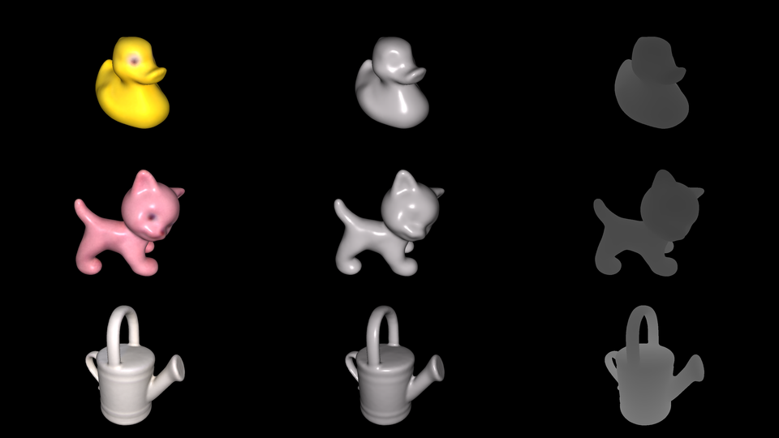
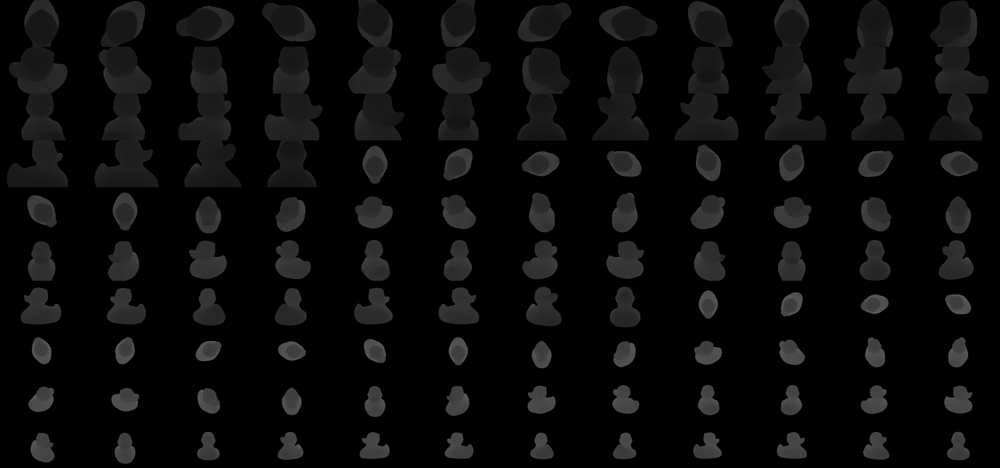

# 6DL-PoseGenerator



## Overview

This repository uses OpenGL and custom shaders to render synthetic data from a 3D model of an object (with or without texture). The generated data can be used to train 6D object pose estimation algorithms or for 2D segmentation tasks.

## Important features:
- [x] [BOP format](https://github.com/thodan/bop_toolkit/blob/master/docs/bop_datasets_format.md) compatibility
- [x] Supports PLY models (ASCII and binary) with associated texture or RGB vertex colors (both optional).
- [x] Photorealistic rendering with lighting manipulation
- [x] Depth rendering with a controllable depth scale.


# Installation

```
git clone https://github.com/POSE-Lab/6DL-PoseGenerator
conda create -n dlpose python=3.10
conda activate dlpose
cd 6DL-PoseGenerator
pip install -r requirements.txt
```
# Usage
1. Modify the ```config.yaml``` according to your needs (See [Parameters](#parameters) section).
2. Run ```python render.py --io.config config.yaml``` .

You can find a full list of available parameters also from the CLI by typing ```python render.py --help```.

We also provide a script to visualize object poses. The poses have to be in [BOP format](https://github.com/thodan/bop_toolkit/blob/master/docs/bop_datasets_format.md). To visualize poses, run the following command:
```
python vis_poses.py \
--poses ./savePath/scene_gt.json \
--images ./savePath/texture/rgb \
--camera-params ./savePath/scene_camera.json \
--model-path ./demo/models/duck.ply \
--outPath ./vis
--opacity 0.7 # the opacity of the overlayed pose
```
You can view the availabe CLI arguments by running ```python vis_poses.py --help```.
# Parameters

Modify the ```config.yaml``` file according to your requirements, including also the 3D model path and output path. Key parameters you can modify include::

- General Rendering parameters:
    - FBO_WIDTH, FBO_HEIGHT: Resolution of rendered images.
    - phis, thetas, distances: Ranges (min, max) and steps for angles (phi, theta) and distances, represented as triplets {min value, max value, step}. Angles are expressed in degrees, and distances in the same units as your model.
    - background_color: The background color.
- Shader Associated parameters:
    - render_modes: Modes to render, e.g., 'triangles' (geometry without texture but with lighting), 'texture' (textured model with lighting), and 'depth' (depth image rendering).
    - texture_file: Path to texture file.

    **Note:** o use RGB vertex colors instead of a texture, set ```texture_file = Null```. Otherwise, provide the path to the texture image.
- Lighting settings:
    - light_position: Position of the light. By default, it is set to ```Null```, meaning the light coincides with the current camera position.
    - {triangles,texture}_{ambient,specular}_strength: Control Phong shading parameters.
    - triangles_object_color: Color of the mesh only when rendering in ```triangles``` mode.
- Pose associated parameters:
    - {rotation,translation}_perturbation: Introduces random rotations/translations for diverse pose distributions.
    - {rotation,translation}_{x,y,z}range: Magnitudes of random rotations/translations in the same units as the object model.
    - depth_scale: Depth is saved as a 16-Bit Gray scale image. Thus the pixel value range from 0-65535. A depth_scale = 1 ensures a 1:1 correspondence with the model's units. For small models, increasing the depth scale is recommended.
- Io associated parameters:
    - model_path: Path to the 3D model
    - object_id: Object ID used for writing the ```scene_gt.json``` file (see BOP format). (See [BOP format](https://github.com/thodan/bop_toolkit/blob/master/docs/bop_datasets_format.md)) 
    - savePath: Path to save renderings.


## Expected results

The ```savePath``` directory (set in config.yaml) should have the following structure after rendering:

```
.
├── depth
├── geom
├── texture
├── scene_gt.json
└── scene_camera.json
```
- ```depth```: Contains depth images.
- ```geom/rgb/```: Images rendered in ```triangles``` mode (See [Parameters](#parameters) section).
- ```texture/rgb/```: Images renderd in ```texture``` mode (See [Parameters](#parameters) section).
- ```scene_gt.json```: Poses in BOP format.
- ```scene_camera.json```: Camera intrisics in BOP format. 

## Demo example 1

For ```./demo/duck.ply``` the rendered results are shown below. Note that these images were produced with ```rotation_perturbation = False``` and ```rotation_perturbation = False```.
### Texture + Lighting

### Geometry + Lighting

### Depth (Depth scale = 5000)



## Demo example 2

With ```rotation_perturbation = True``` and ```translation_perturbation = True```.


## Citation

This repository extends the implementation used in our paper, [Crane Spreader Pose Estimation from a Single View](https://www.scitepress.org/PublishedPapers/2023/117888/117888.pdf). TRenderings from this pipeline were used to train a 6D pose estimation deep learning algorithm with synthetic data.

If you find this code useful, please cite it using the following BibTeX entry.

```bibtex
@article{pateraki_sapoutzoglou_lourakis_2023, 
    title={Crane Spreader Pose Estimation from a Single View}, 
    url={https://www.scitepress.org/PublishedPapers/2023/117888/117888.pdf}, 
    DOI={https://doi.org/10.5220/0011788800003417}, 
    journal={Proceedings of the 18th International Joint Conference on Computer Vision, Imaging and Computer Graphics Theory and Applications}, 
    publisher={SCITEPRESS - Science and Technology Publications}, 
    author={Pateraki, Maria and Sapoutzoglou, Panagiotis and Lourakis, Manolis}, 
    year={2023}, 
    pages={796–805}
}
```